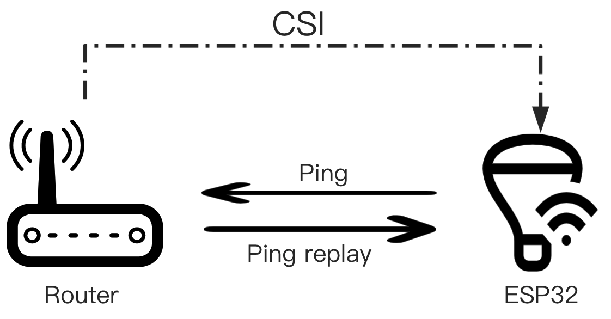
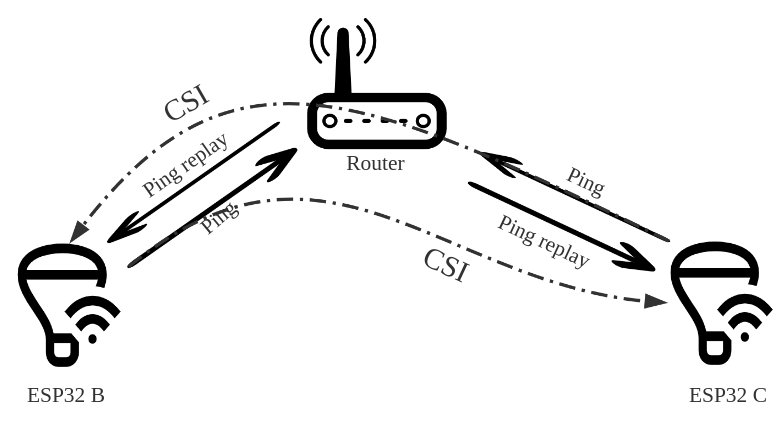
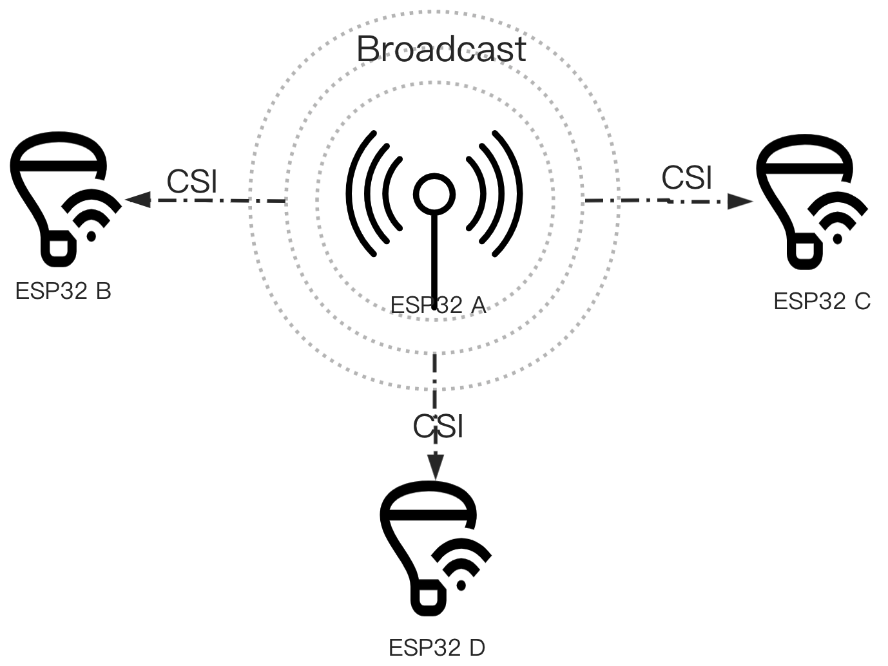

# ESP-CSI [[中文]](./README_cn.md)

## Introduction to CSI

Channel State Information (CSI) is an important parameter that describes the characteristics of a wireless channel, including indicators such as signal amplitude, phase, and signal delay. In Wi-Fi communication, CSI is used to measure the state of the wireless network channel. By analyzing and studying changes in CSI, one can infer physical environmental changes that cause channel state changes, achieving non-contact intelligent sensing. CSI is very sensitive to environmental changes. It can sense not only large movements such as people or animals walking and running but also subtle actions in a static environment, such as breathing and chewing. These capabilities make CSI widely applicable in smart environment monitoring, human activity monitoring, wireless positioning, and other applications.

## Basic Knowledge

To better understand CSI technology, we provide some related basic knowledge documents (to be updated gradually):

- [Signal Processing Fundamentals](./docs/en/Signal-Processing-Fundamentals.md)
- [OFDM Introduction](./docs/en/OFDM-introduction.md)
- [Wireless Channel Fundamentals](./docs/en/Wireless-Channel-Fundamentals.md)
- [Introduction to Wireless Location](./docs/en/Introduction-to-Wireless-Location.md)
- [Wireless Indicators CSI and RSSI](./docs/en/Wireless-indicators-CSI-and-RSSI.md)
- [CSI Applications](./docs/en/CSI-Applications.md)

## Advantages of Espressif CSI

- **Full series support:** All ESP32 series support CSI, including ESP32 / ESP32-S2 / ESP32-C3 / ESP32-S3 / ESP32-C6.
- **Strong ecosystem:** Espressif is a global leader in the Wi-Fi MCU field, perfectly integrating CSI with existing IoT devices.
- **More information:** ESP32 provides rich channel information, including RSSI, RF noise floor, reception time, and the 'rx_ctrl' field of the antenna.
- **Bluetooth assistance:** ESP32 also supports BLE, for example, it can scan surrounding devices to assist detection.
- **Powerful processing capability:** The ESP32 CPU is dual-core 240MHz, supporting AI instruction sets, capable of running machine learning and neural networks.
- **OTA upgrade:** Existing projects can upgrade to new CSI features through software OTA without additional hardware costs.

## Example Introduction

### [get-started](./examples/get-started)

Helps users quickly get started with CSI functionality, demonstrating the acquisition and initial analysis of CSI data through basic examples. For details, see [README](./examples/get-started/README.md).

- [csi_recv](./examples/get-started/csi_recv) demonstrates the ESP32 as a receiver example.
- [csi_send](./examples/get-started/csi_send) demonstrates the ESP32 as a sender example.
- [csi_recv_router](./examples/get-started/csi_recv_router) demonstrates using a router as the sender, with the ESP32 triggering the router to send CSI packets via Ping.
- [tools](./examples/get-started/tools) provides scripts for assisting CSI data analysis, such as csi_data_read_parse.py.

### [esp-radar](./examples/esp-radar)

Provides some applications using CSI data, including RainMaker cloud reporting and human activity detection.

- [connect_rainmaker](./examples/esp-radar/connect_rainmaker) demonstrates capturing CSI data and uploading it to Espressif's RainMaker cloud platform.
- [console_test](./examples/esp-radar/console_test) demonstrates an interactive console that allows dynamic configuration and capture of CSI data, with applications for human activity detection algorithms.

## How to get CSI

### 4.1 Get router CSI

- **How ​​to implement:** ESP32 sends a Ping packet to the router, and receives the CSI information carried in the Ping Replay returned by the router.
- **Advantage:** Only one ESP32 plus router can be completed.
- **Disadvantages:** Depends on the router, such as the location of the router, the supported Wi-Fi protocol, etc.
- **Applicable scenario:** There is only one ESP32 in the environment, and there is a router in the detection environment.

### 4.2 Get CSI between devices

- **How ​​to implement:** ESP32 A and B both send Ping packets to the router, and ESP32 A receives the CSI information carried in the Ping sent by ESP32 B, which is a supplement to the first detection scenario.
- **Advantage:** Does not depend on the location of the router, and is not affected by other devices connected under the router.
- **Disadvantage:** Depends on the Wi-Fi protocol supported by the router, environment.
- **Applicable scenario:** There must be more than two ESP32s in the environment.

### 4.3 Get CSI specific devices

- **How ​​to implement:** The packet sending device continuously switches channels to send out packets. ESP32 A, B, and C all obtain the CSI information carried in the broadcast packet of the packet sending device. This method has the highest detection accuracy and reliability.
- **Advantages:** The completion is not affected by the router, and the detection accuracy is high. When there are multiple devices in the environment, only one packet sending device will cause little interference to the network environment.
- **Disadvantages:** In addition to the ordinary ESP32, it is also necessary to add a special package issuing equipment, the cost is the same and higher.
- **Applicable scenarios:** Suitable for scenarios that require high accuracy and multi-device cluster positioning.

## 5 Note

1. The effect of external IPEX antenna is better than PCB antenna, PCB antenna has directivity.
2. Test in an unmanned environment. Avoid the influence of other people's activities on test results.

## 6 Related resources

- [ESP-IDF Programming Guide](https://docs.espressif.com/projects/esp-idf/en/latest/esp32/index.html) is the documentation for the Espressif IoT development framework.
- [ESP-WIFI-CSI Guide](https://docs.espressif.com/projects/esp-idf/en/latest/esp32/api-guides/wifi.html#wi-fi-channel-state-information) is the use of ESP-WIFI-CSI Description.
- Community project recommendation: [ESPectre](https://github.com/francescopace/espectre), a motion detection system based on Wi-Fi CSI spectrum analysis with Home Assistant integration. It can be used as a reference implementation for bringing CSI research into real smart-home scenarios.
- If you find a bug or have a feature request, you can submit it on [Issues](https://github.com/espressif/esp-csi/issues) on GitHub. Please check to see if your question already exists in the existing Issues before submitting it.

## 7 요약본

1. TX(송신기)에서 브로드캐스트하는 방법

csi_send/main/app_main.c
 코드를 보면, TX는 ESP-NOW 프로토콜을 사용하여 데이터를 전송합니다.

초기화 (

wifi_esp_now_init
): ESP-NOW 환경을 구성하고, 받을 대상(Peer)의 MAC 주소를 FF:FF:FF:FF:FF:FF(브로드캐스트 주소)로 등록합니다. 특정 기기를 지정하는 것이 아니라 해당 채널(예: 채널 11)을 듣고 있는 모든 기기가 패킷을 수신할 수 있게 합니다.
데이터 전송 (

app_main
 루프): 무한 루프를 돌면서 esp_now_send() 함수를 호출합니다. 이때 전송하는 데이터 패킷 페이로드(Payload) 자체는 4바이트 크기의 단순한 숫자(count 변수)입니다. 1초에 지정된 횟수(CONFIG_SEND_FREQUENCY, 기본 100번)만큼 이 카운트 값을 1씩 증가시키며 브로드캐스트로 허공에 뿌립니다.
2. 패킷의 정보
서로 통신할 때 쏘는 패킷은 ESP-NOW Action Frame(Wi-Fi Vendor Specific 프레임) 형태입니다. 우리가 코드상에서 보내는 실제 데이터는 count라는 아주 작은 숫자일 뿐이지만, 이 패킷이 공기 중으로 날아갈 때 앞에 붙는 **Wi-Fi 물리 계층 프리앰블(Preamble)**이 매우 중요합니다. Preamble 안에는 L-LTF, HT-LTF 같은 훈련용 신호(Training Symbol)가 들어있으며, 수신기 하드웨어는 이 신호가 공간(장애물, 벽, 움직임 등)을 거치며 어떻게 왜곡(진폭과 위상 변화)되었는지 계산합니다. 이 왜곡 정보가 바로 CSI입니다.

3. RX(수신기)의 처리 및 CSI 도출 (코드 측면)

csi_recv/main/app_main.c
는 이 방송(브로드캐스트)을 듣고 CSI 정보를 뽑아냅니다.

CSI 콜백 등록 (

wifi_csi_init
): Wi-Fi를 Promiscuous 모드(오가는 모든 패킷을 엿듣는 모드)로 설정하고, 하드웨어가 CSI를 추출할 수 있도록 esp_wifi_set_csi_config 및 esp_wifi_set_csi_rx_cb를 통해 콜백 함수를 등록합니다.
패킷 수신 (

wifi_csi_rx_cb
): TX 패킷이 도달하면 하드웨어 단에서 추출한 CSI 정보를 담아 이 콜백 함수가 호출됩니다.
TX 필터링: 수신된 패킷의 보낸 사람 MAC 주소가 우리가 지정한 TX 기기(CONFIG_CSI_SEND_MAC)가 맞는지 확인하여 걸러냅니다.
데이터 및 환경 정보 추출: 헤더나 페이로드 안쪽에 담긴 방금 전송된 count 값(rx_id)과 신호 감도(RSSI), 노이즈 환경(noise_floor), 채널, Gain 데이터 등을 읽어옵니다.
CSI 값 직렬화: 수신된 CSI 버퍼(info->buf) 배열에 들어있는 서브캐리어별 복소수(Complex Number, 실수부+허수부) 데이터를 문자열로 변환합니다. ets_printf 함수를 통해 CSI_DATA로 시작하는 CSV 형태의 한 줄 문자열 기호열 포맷을 콘솔 시리얼(UART)로 텍스트 출력합니다.
4. PC에서의 전체 수집 흐름 (Python 스크립트)
RX로 작동하는 여러 대의 ESP32 보드들은 실시간으로 이 CSV 형태의 문자열을 계속해서 USB(Serial) 포트로 뱉어냅니다. 이를 

multi_rx_collect_csi.py
가 받아 다음과 같이 처리합니다.

다중 스레딩 (

collect_csi_thread
): 사용자가 -p COM3 COM4 처럼 여러 포트를 입력하면, 각각의 ESP32 수신기를 담당하는 동시 작업(Thread)을 각 포트별로 하나씩 만듭니다.
시리얼 읽기 및 파싱 (ser.readline): 각 스레드는 자기가 맡은 USB 포트에서 문자열(strings)을 한 줄씩 끊어 읽습니다.
CSV 저장 (csv_writer.writerow):
만약 처음 받은 문자열이 type,recv_mac,seq... 와 같이 C 코드에서 찍어준 CSV의 컬럼명 헤더라면, 각 파일의 최상단에 이 헤더를 기록합니다.
만약 문자열이 CSI_DATA로 시작한다면, 쉼표(,)를 기준으로 쪼개어 RX 기기별로 할당된 각각의 분리된 CSV 파일(ex. csi_measured_data_COM3.csv)에 한 줄의 Row로 써넣고 파일 시스템에 플러시(flush)하여 데이터를 실시간으로 차곡차곡 쌓게 됩니다.
즉, [TX의 단순 숫자 브로드캐스트] -> [공간 인프라(Wi-Fi 물리신호 변형)] -> [RX 하드웨어가 이를 감지하고 CSI 데이터로 수치화하여 UART 텍스트로 송신] -> [PC 파이썬 스크립트가 여러 포트를 모니터링하며 각각 CSV 파일로 매핑해 로깅] 하는 구조로 통신 시스템이 톱니바퀴처럼 돌아가고 있습니다.

## Reference

1. [Through-Wall Human Pose Estimation Using Radio Signals](http://rfpose.csail.mit.edu/)
2. [A list of awesome papers and cool resources on WiFi CSI sensing](https://github.com/Marsrocky/Awesome-WiFi-CSI-Sensing#awesome-wifi-sensing)
